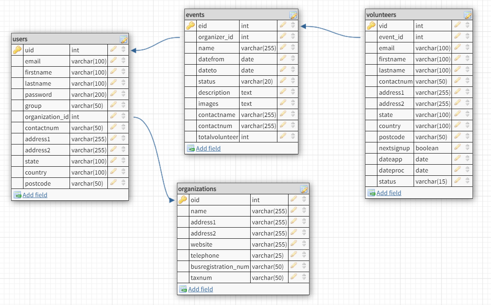

# Focal
<!--  -->

A web application for members to create ........

<!-- ## Motivation

**FOR** individuals or small associations **WHO** want to organize a charity drive; **THE** product **IS** a web application **THAT** gathers volunteers to sign-up for the event **UNLIKE** having insufficient volunteers or sponsors; **OUR PRODUCT** helps the organizers reach out to a wider audience and create awareness to the public.

**FOR** the public **WHO** wants to give back to the community; **THE** product **IS** a web application **THAT** gives information about upcoming charity events and allow users to sign-up as a volunteer **UNLIKE** having to browse through many sites; **OUR PRODUCT** helps the user search for a charity event with ease. -->

## Features

- Create crowdfunding events
- Sign-up as investor/mentor

<!-- ## Feature Wish List

### Nice To Have Features

- Volunteers signing-up as member with availibilty details for future events that matches preference

- Donation to the charity event directly when there is proper agreement documented between our app and parties involved

- A networking platform for our app members to connect with bigger NGO/ other organizations with community projects

- Our app to provide API service of community projects and volunteers lists in Malaysia -->

## Tech / Framework

Built with Vue.Js (Vuetify,VueRouter,Vuex), Node/Express.Js, MySQL, Firebase, Jest (Testing), Google Sign-in API, ...

<!-- ## Database Schema



## API Routes Plan

URI | HTTP Method | Description
--- | ----------- | -----------
/api/events | GET/ POST | Get all events/ Add an event
/api/events/organizer:id | GET | Get all events by an organizer
/api/events:id | GET/ PUT/ DELETE | Get an event by id/ Update an event by id/ Delete an event by id
/api/organizations | GET | Get all organizations
/api/organizations:id | GET | Get an organization by id
/api/volunteers/:id | GET/ PUT/ DELETE | Get all volunteers by event/ Update volunteer's application/ Delete volunteer application
/api/volunteers/organizers:id | GET | Get all volunteers under an organizer
/api/volunteers/:id/application-status/:status | GET | Get all volunteers by event id and application status
/api/volunteers | POST | Add an application to volunteers for an event

## User Flow Diagram


## Architecture Drawing

 -->

## Setup

### Dependencies

- Run `npm install` in project directory. This will install server-related dependencies such as `express`
- `cd client` and run `npm install`. This will install client dependencies

### Database Prep

- Access the MySQL interface in your terminal by running `mysql -u root -p`
- Create a new database called focaldb: `create database focaldb;`
- Create a `.env` file in project directory and add

```bash
  DB_NAME=focaldb
  DB_PASS=YOURPASSWORD
  JWT_SECRET=YOURSECRET
```

- Replace `YOUR_PASSWORD` with your actual password

- Run `npm run migrate` in the main folder of this repository, in a new terminal window. This will create 4 tables (applications, events, organizations and users) in your database.

### Run Your Development Servers

- Run `npm start` in project directory to start the Express server on port 5000
- `cd client` and run `npm start` to run your development build. The app will run on `http://localhost:8080` as the default port.

<!-- ## Reference

- [Charity Article](https://vulcanpost.com/693014/covid-19-charity-donation-malaysia-food-medical-supplies/)
- [Web Charity API List](https://www.programmableweb.com/category/charity/api)
- [Global Giving API](https://www.globalgiving.org/companies/web-services/)
- [Charity Navigator API](https://www.charitynavigator.org/index.cfm?bay=content.view&cpid=1397)

## Notes

_This is a student project that was created at [CodeOp](http://CodeOp.tech), a full stack development bootcamp in Barcelona and [Rebound.Asia](https://www.rebound.asia/breakthrough), by TechSprint Academy (Malaysia’s first women only coding academy)._ -->
